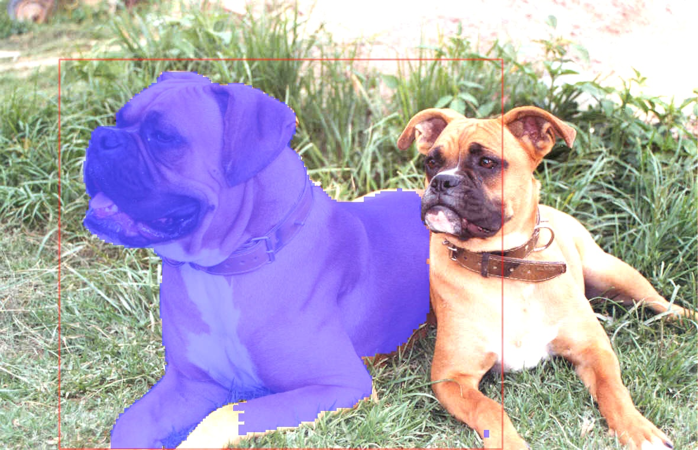

# SAM
This model is based on [NanoSAM](https://github.com/NVIDIA-AI-IOT/nanosam).

## Get model
### ONNX
1. Download the image encoder ONNX file from [here](https://drive.google.com/file/d/14-SsvoaTl-esC3JOzomHDnI9OGgdO2OR/view?usp=drive_link).
2. Download the mask decoder ONNX file from [here](https://drive.google.com/file/d/1jYNvnseTL49SNRx9PDcbkZ9DwsY8up7n/view?usp=drive_link).
3. Or you can export mannally following [NanoSAM](https://github.com/NVIDIA-AI-IOT/nanosam).

### TensorRT
- image encoder
```
${tensorrt-install-path}/bin/trtexec \
    --onnx=data/resnet18_image_encoder.onnx \
    --saveEngine=data/resnet18_image_encoder.engine \
    --fp16
```

- mask decoder
```
${tensorrt-install-path}/bin/trtexec \
    --onnx=weights/sam/mobile_sam_mask_decoder.onnx \
    --saveEngine=weights/sam/mobile_sam_mask_decoder.engine \
    --minShapes=point_coords:1x1x2,point_labels:1x1 \
    --optShapes=point_coords:1x1x2,point_labels:1x1 \
    --maxShapes=point_coords:1x10x2,point_labels:1x10
```

## Inference
### ONNXRuntime
#### Build
```
mkdir build && cd build
cmake .. -DCMAKE_EXPORT_COMPILE_COMMANDS=ON -DUSE_TENSORRT=OFF
make
```
#### Config
config/sam/image_encoder.yaml
```
model_name: "sam_image_encoder"
model_path: "../weights/sam/resnet18_image_encoder.onnx"
framework: "ONNX"
```
config/sam/mask_decoder.yaml
```
model_name: "sam_mask_decoder"
model_path: "../weights/sam/mobile_sam_mask_decoder.onnx"
framework: "ONNX"
```
#### Run
```
cd build
./test/ocr_test
```

### TensorRT
#### Build
```
mkdir build && cd build
cmake .. -DCMAKE_EXPORT_COMPILE_COMMANDS=ON -DUSE_TENSORRT=ON
make
```
#### Config
config/sam/image_encoder.yaml
```
model_name: "sam_image_encoder"
model_path: "../weights/sam/resnet18_image_encoder.engine"
framework: "TensorRT"
```
config/sam/mask_decoder.yaml
```
model_name: "sam_mask_decoder"
model_path: "../weights/sam/mobile_sam_mask_decoder.engine"
framework: "TensorRT"
```
#### Run
```
cd build
./test/ocr_test
```

### Sample result
<p align="center"></p>