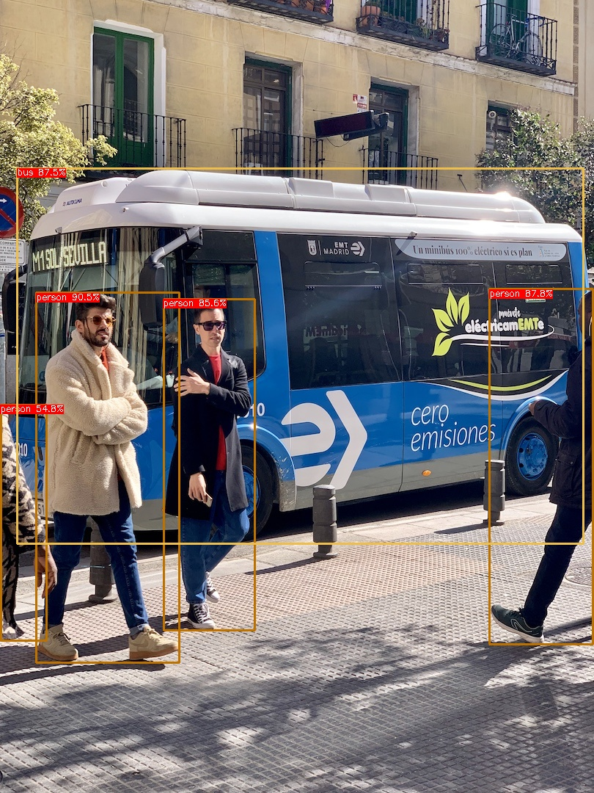
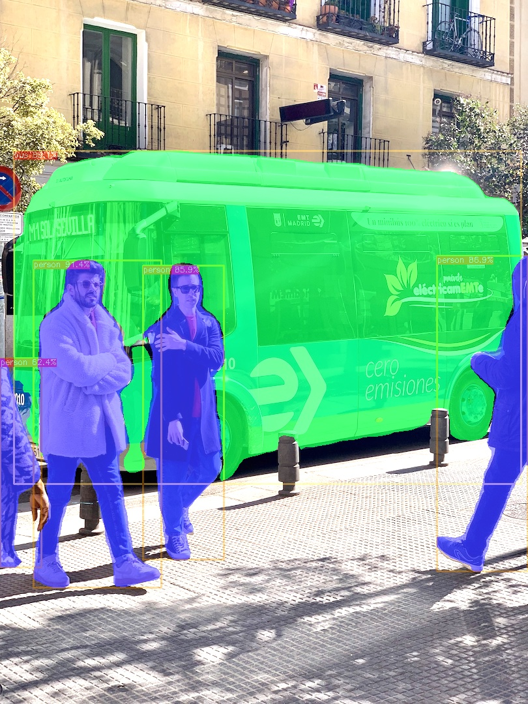
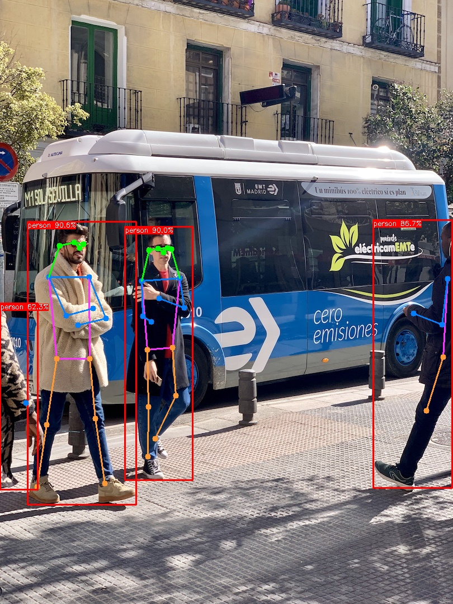

# YOLO
In this repo, all versions of yolo algorithms are exported with the same inputs and outputs, so we can use the same C++ code to inference.
## Prepare
```
python3 -m pip install ultralytics, onnx, onnxsim
```

## Get pytorch model
```
# yolov8s-detect
wget https://github.com/ultralytics/assets/releases/download/v8.1.0/yolov8s.pt
# yolov8s-seg
wget https://github.com/ultralytics/assets/releases/download/v8.1.0/yolov8s-seg.pt
# yolov9c
wget https://github.com/WongKinYiu/yolov9/releases/download/v0.1/yolov9-c-converted.pt
```

## Export
### ONNX
#### YOLOv8-Detect
```
# without-nms
python3 model/yolo/yolov8-det-export.py --weights=path-to-your-weights --sim
# with onnx-nms plugin
python3 model/yolo/yolov8-det-export.py --weights=path-to-your-weights --sim --onnx-nms
# with trt-nms plugin (only for tensorrt transfer, not support to inference with onnxruntime C++)
python3 model/yolo/yolov8-det-export.py --weights=path-to-your-weights --sim --trt-nms
```

#### YOLOv8-Segment
```
python3 model/yolo/yolov8-seg-export.py --weights=path-to-your-weights --sim
```

#### YOLOv8-Pose
```
python3 model/yolo/yolov8-pose-export.py --weights=path-to-your-weights --sim
```

#### YOLOv9-Detect
```
git clone https://github.com/WongKinYiu/yolov9.git
cp model/yolo/yolov9-det-export.py yolov9/
cd yolov9
# without-nms
python3 yolov9-det-export.py --weights=path-to-your-weights --sim
# with onnx-nms plugin
python3 yolov9-det-export.py --weights=path-to-your-weights --sim --onnx-nms
# with trt-nms plugin (only for tensorrt transfer, not support to inference with onnxruntime C++)
python3 yolov9-det-export.py --weights=path-to-your-weights --sim --trt-nms
```

### TensorRT
```
${tensorrt-install-path}/bin/trtexec                                                             
--onnx=path-to-your-onnx-model \
--saveEngine=save-path \
--fp16
```

### RKNN
See [airockchip/rknn-model-zoo](https://github.com/airockchip/rknn_model_zoo)

## Inference
### Build
```
mkdir build && cd build
# disable tensorrt
cmake .. -DCMAKE_EXPORT_COMPILE_COMMANDS=ON -DUSE_TENSORRT=OFF
# enable tensorrt
cmake .. -DCMAKE_EXPORT_COMPILE_COMMANDS=ON -DUSE_TENSORRT=ON
make
```
### Config
#### Detect
```
model_name: "yolo"
model_path: "path-to-model-file"
framework: "ONNX"       # ("ONNX" or "TensorRT", corresponding to your model)
input_size: [640,640]
with_nms: true
conf_thres: 0.25
nms_thres: 0.65
topk: 100
```
#### Segment
```
model_name: "yolo_seg"
model_path: "path-to-model-file"
framework: "ONNX"      # ("ONNX" or "TensorRT", corresponding to your model)
input_size: [640,640]
conf_thres: 0.25
nms_thres: 0.65
seg_size: [160, 160]
seg_channels: 32
```
#### Segment-Cutoff
```
model_name: "yolo_seg"
model_path: "../weights/yolo/yolov8s-seg.rknn"
framework: "RKNN"
input_size: [640,640]
conf_thres: 0.25
nms_thres: 0.65
seg_size: [160, 160]
seg_channels: 32
class_num: 80
topk: 100
```

#### Pose
```
model_name: "yolo_pose"
model_path: "path-to-model-file"
framework: "ONNX"      # ("ONNX" or "TensorRT", corresponding to your model)
input_size: [640,640]
conf_thres: 0.25
nms_thres: 0.65
```

#### Run
```
mkdir -p output/yolo/detect
mkdir output/yolo/segment
cd build
./test/yolo_test
```

### Example output
<p align="center"></p>
<p align="center"></p>
<p align="center"></p>